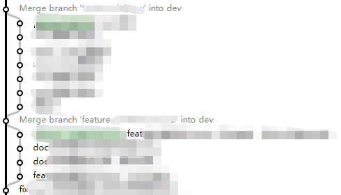

# git 团队规范

本文并不包括基本的 git 操作，仅包括 git 在团队开发中的规范，基本 git 操作可参阅以下资料：

- [Pro Git 中文版 ](https://git-scm.com/book/zh/v2)      git 官方推荐书籍，强烈建议阅读。
- [廖雪峰 git 教程](https://www.liaoxuefeng.com/wiki/0013739516305929606dd18361248578c67b8067c8c017b000)

## commit 格式规范

规范的格式能够为 commit 带来更好的可读性，并且能够提供更多的历史信息，方便快速浏览和快速查找信息。这里推荐目前使用最广的 [angulr 规范](https://github.com/angular/angular/blob/master/CONTRIBUTING.md#commit)。

```js
<type>(<scope>): <subject>
<BLANK LINE>
<body>
<BLANK LINE>
<footer>
```
该规范由 `type`、`body` 和 `footer` 3部分组成：

### header
header 部分由 `type` (必需）、`scope` (可选) 和 `subject` (必需) 3部分组成。

`header: <type>(<scope>): <subject>`

#### Type
`Type` 用于说明 commit 的类别，只允许使用下面8个标识。
- build: 影响构建系统或外部依赖项的更改（示例范围：gulp，broccoli，npm）
- ci: CI 配置文件和脚本的更改 (示例范围: Travis,Circle, BrowserStack, SauceLabs)
- docs: 仅更改文档
- feat: 新功能
- fix: 修复bug
- perf: 提升性能的代码更改
- refactor: 没有增加新功能或者修补bug的代码更改
- style: 不影响代码含义的更改 (空格、格式、缺少分号等)
- test: 添加缺失的测试用例或更正现有测试用例

#### Scope
用于说明 commit 影响的范围，视项目不同而不同。

#### Subject
`Subject` 是 commit 目的的简短描述，不超过50个字符。
- 以动词开头，使用第一人称现在时，比如change，而不是changed或changes
- 第一个字母小写
- 结尾不加句号（.）

### Body
`Body` 部分是对本次 commit 的详细描述，可以分成多行。

### Footer
`Footer` 用于包含 Breaking Changes 的信息，也用于关闭 github issue。


## git 分支规范

图源（[ A successful Git branching model ](https://nvie.com/posts/a-successful-git-branching-model/)）


下面详细介绍下各个分支以及合并的注意事项。

### master 

`master` 分支作为主分支，应作为生产环境使用的代码分支，`master` 分支强烈建议按照[语义化版本](https://semver.org/lang/zh-CN/)在每次上线新版本时打tag。并保证每次上线新版本时代码库内文档和注释已更新。并更新 changelog 文件，详细说明本次迭代修复 bug 以及新增功能等。

### develop

`develop` 分支作为主开发分支，所有的 `feature` 分支都必须以该分支为基准，并且应保证 `develop` 分支不会出现开发到一半的功能，即所有的 `feature` 分支应开发完毕才能合并至 `develop`。因为 `develop` 分支最终是合并到 `master` 作为生产环境代码。当 `develop` 分支出现了开发到一半的功能时，就无法将该功能剔除，单独上线其他功能。

### feature

每个单独的功能点应独立成一个 `feature` 分支，待该功能开发完毕后才能合并至 `develop`。这样易于控制每次版本更新时的功能点迭代，例如某个功能开发周期长于版本迭代时间，该功能的 `feature` 分支即可越过版本迭代的时间点，待下下次版本或更靠后的时间上线。

### release 

`release` 分支通常作为正式上线前的测试分支，仅作 bug 修复。待 bug 修复完毕后合并至 `master` 和 `develop` 分支，保证 `develop` 和 `master` 的代码一致性。

### hotfixes

`hotfixes` 分支作为生产环境 bug 修复的分支，从 `master` 分支拉取，因为 `develop` 分支有可能已合并了新的 `feature` 分支。待 bug 修复后将 `hotfixes` 分支合并至 `master` 和 `develop` 分支。

## git 合并规范

### rebase

强烈建议阅读以下文章以深入了解 `rebase`, 并建议完全理解`rebase`对 git 带来的影响后再尝试使用该命令。
[Git 分支 - 变基](`https://git-scm.com/book/zh/v2/Git-%E5%88%86%E6%94%AF-%E5%8F%98%E5%9F%BA`)

#### 使用 `git pull --rebase` 替代 `git pull`
git 初学者应该会发现经常出现一个同分支和远程仓库合并的 commit 信息，自动生成的 commit 信息如下：
```js
Merge remote-tracking branch ‘origin/develop’ into develop
```
该 commit 无任何有效信息，会生成是因为 `git pull` 等同于 `git fetch ` + `git merge`。在 `git merge` 时生成了这个无效信息。 避免出现该信息的方式为使用 `git pull --rebase` 替代 `git pull`。`git pull --rebase` 等同于 `git fetch` + `git rebase`。这样就可避免 `commit` 流中出现同分支合并的无效信息。

#### 在 feature 分支上 `rebase` develop 分支

如果时常将 `develop` 分支 的 `commit` merge 进 `feature` 分支。就会造成 `develop` 分支的提交信息污染 `feature` 分支的提交信息，增加理解项目历史的难度。另外一方面，如果不时常将 `develop` 分支 的 `commit` 合并至 `feature`，随着开发时间的推移，`develop` 和 `feature` 分支的冲突会积累的越来越多。如果等到 `feature` 分支新功能开发完毕再合并，冲突可能会累积到无法解决的地步。这时我们在开发过程中使用 `get rebase`解决两个分支冲突的问题。即使用以下命令:
```bash
// 在 feature 分支
git rebase develop
```
这样既可解决两个分支之间的冲突，也避免污染 feature 分支的 commit 记录。

#### **严禁在多人同时使用的分支上使用 rebase 命令**
rebase 命令可能会更改分支的提交记录，严禁在多人同时使用的分支上使用 rebase 命令。这样 push 会导致他人本地分支和远程分支历史 commit 信息冲突。

### merge

#### 将 feature 分支合并至 develop 分支时使用 git merge --no-ff

如果严格按照在 feature 分支上 `rebase` develop 分支的规范，最终将 feature 分支合并至 develop 分支上是一定会执行 fast-farward merge。因为默认情况下，Git执行"快进式合并"（fast-farward merge），会直接将 Develop 分支指向 feature 分支。这样会导致 feature 分支的提交并不会保留，只保留 develop 单条分支记录。而使用 get merge --no-ff 将会保留 feature 分支的分支记录。如下图：


以上，采用了 commit 规范、branch 规范和合并规范后，我们能够实现一个具有可读性的 git commit 信息流：每个功能点的 commit 记录在一条分支上，通过 commit 记录的信息能够还原整个开发过程。



## 附录：git 常用进阶命令

### git status
[git status](https://git-scm.com/book/zh/v2/Git-%E5%B7%A5%E5%85%B7-%E5%82%A8%E8%97%8F%E4%B8%8E%E6%B8%85%E7%90%86) 

有时，当你在项目的一部分上已经工作一段时间后，所有东西都进入了混乱的状态，而这时你想要切换到另一个分支做一点别的事情。 问题是，你不想仅仅因为过会儿回到这一点而为做了一半的工作创建一次提交。 针对这个问题的答案是 git stash 命令。
### git reflog

[git reflog](https://git-scm.com/docs/git-reflog)

[数据恢复](https://git-scm.com/book/zh/v1/Git-%E5%86%85%E9%83%A8%E5%8E%9F%E7%90%86-%E7%BB%B4%E6%8A%A4%E5%8F%8A%E6%95%B0%E6%8D%AE%E6%81%A2%E5%A4%8D#%E6%95%B0%E6%8D%AE%E6%81%A2%E5%A4%8D)

当你 (在一个仓库下) 工作时，Git 会在你每次修改了 HEAD 时悄悄地将改动记录下来。当你提交或修改分支时，reflog 就会更新。


## 参考资料
- [Pro Git 中文版](https://git-scm.com/book/zh/v2)  git 官方推荐书籍，强烈建议阅读。
- [angulr commit 规范](https://github.com/angular/angular/blob/master/CONTRIBUTING.md#commit)
- [简介我的 Git Work Flow](https://juejin.im/post/5a30cf876fb9a0450167f29a#heading-8)
- [ A successful Git branching model ](https://nvie.com/posts/a-successful-git-branching-model/)
- [廖雪峰 git 教程](https://www.liaoxuefeng.com/wiki/0013739516305929606dd18361248578c67b8067c8c017b000)